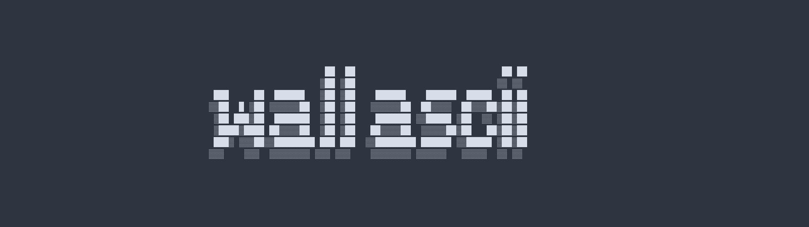
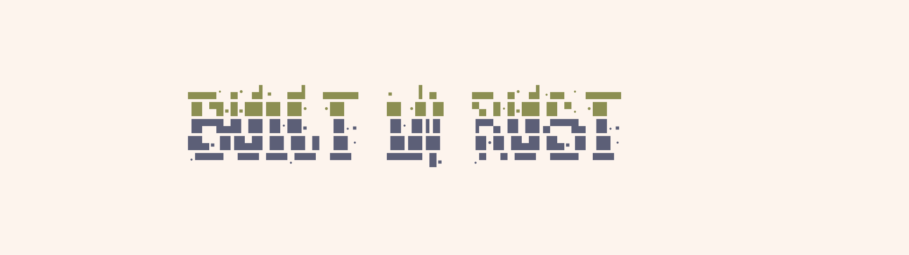

<div align="center">

# wallascii

**Transform text into ASCII wallpapers**

[](https://www.rust-lang.org/)
[](LICENSE)

[Features](#-features) • [Installation](#-installation) • [Usage](#-usage) • [Themes](#-color-themes) • [Fonts](#-fonts)

</div>

---

## Examples

<div align="center">

<br/>

</div>

## Features

- **35+ Color Themes**
- **120+ Fonts**
- **Custom Resolutions**
- **Interactive TUI**

## Installation

### From Source

```bash
git clone https://github.com/xjrf/wallascii.git
cd wallascii
cargo build --release
```

The binaries will be in `target/release/`:
- `wallascii` - Interactive TUI
- `wallascii-cli` - Command-line interface

## Usage

### TUI Mode

Launch the TUI interface:

```bash
./target/release/wallascii
```

### Keyboard Controls

| Key | Action |
|-----|--------|
| `Tab` | Switch sections |
| `←` `→` | Navigate / Switch width/height |
| `↑` `↓` | Select options / Adjust size |
| `Type` | Enter text or values |
| `Backspace` | Delete characters |
| `L` | Toggle layout (when not typing) |
| `G` | Toggle gradient (when not typing) |
| `P` | Preview in external viewer (when not typing) |
| `Q` / `Esc` | Quit |
| `Enter` | Generate wallpaper |

**Note:** L, G, P shortcuts only work when you're not in text input mode.

### CLI Mode

Quick generation without the TUI:

```bash
# Basic usage
./target/release/wallascii-cli "Hello World"

# With custom font and theme
./target/release/wallascii-cli "Rust" -f banner -c nord

# Full customization
./target/release/wallascii-cli "Code" \
  -f 3d \
  -c nord \
  -o wallpaper.png \
  -l horizontal
```

### List Available Options

```bash
# Show all themes
./target/release/wallascii-cli --list-colors

# Show all fonts
./target/release/wallascii-cli --list-fonts

# Show help
./target/release/wallascii-cli --help
```

## Structure

```
wallascii/
├── src/
│   ├── main.rs           # TUI
│   ├── main_cli.rs       # CLI
│   ├── app.rs            # Application state
│   ├── ui.rs             # TUI rendering
│   ├── event_handler.rs  # Keyboard events
│   ├── fonts.rs          # Font management
│   ├── colors.rs         # Theme definitions
│   ├── ascii_art.rs      # ASCII generation
│   └── image_gen.rs      # PNG rendering
├── fonts/                # FIGlet fonts
├── tests/
├── Cargo.toml
├── LICENSE
└── README.md
```

## Details

### Dependencies

- **retrofont** - FIGlet font rendering
- **ratatui** - Terminal UI framework
- **crossterm** - Cross-platform terminal control
- **image** - Image processing
- **imageproc** - Text rendering
- **ab_glyph** - Font rasterization
- **clap** - CLI argument parsing

### Output Format

Generated wallpapers are saved as PNG with automatic naming:
```
{text}-{font}-{theme}-{size}.png
```

Example: `helloworld-banner-nord-16.png`

## License

This project is licensed under the MIT License - see the [LICENSE](LICENSE) file for details.

## Contributing

Feel free to:

- Report bugs
- Suggest new features
- Add new color themes
- Submit pull requests

## Acknowledgments

- FIGlet fonts from the [FIGlet Font Database](https://github.com/xero/figlet-fonts)
- Built with Rust.
